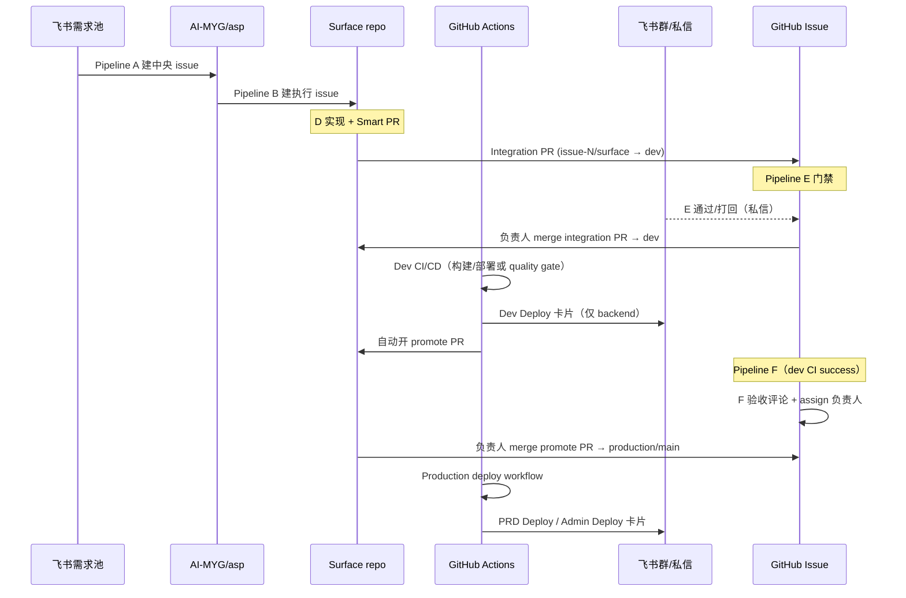

# ASP CI/CD 与用户可感知节点

**Scope**: ASP 全 surface 从代码合入到 dev / production 的部署流水线，以及飞书、GitHub Issue 上用户能看到的通知与状态变化。  
**SSOT 配置**: `config/surfaces.yaml`（分支映射）、`tools/feishu_inbound/config.yaml`（Pipeline F 监听的 workflow 名称）

---

## 1. 两阶段 PR 模型（2026-06 起）

每个 issue / 功能在 **integration** 与 **production** 各走一条独立 PR，禁止累积式 `dev → production` / `dev → main` 大 PR。

| 阶段 | Head 分支 | Base 分支 | 创建方式 | 用户何时感知 |
|------|-----------|-----------|----------|--------------|
| **Integration** | `issue-{N}/{surface}` | `dev` | Smart PR / Team Dev S5 | GitHub PR 通知；E 门禁飞书私信 |
| **Promote** | `promote/issue-{N}/{surface}` | `production` 或 `main` | CI 在 integration 验证成功后自动 cherry-pick 开 PR | GitHub PR；backend dev 飞书卡片含 PR 链接 |
| **Production deploy** | （merge promote PR） | — | merge 后触发 release / deploy workflow | 飞书 **PRD Deploy** / **Admin Deploy** 卡片（见下表） |

| Surface | Integration (`base_branch`) | Production (`production_branch`) | Promote 脚本路径 |
|---------|----------------------------|----------------------------------|------------------|
| backend | `dev` | `production` | `backend/scripts/create_promote_pr.sh` |
| admin / app / wecom / canonical / websites | `dev` | `main` | `scripts/cicd/create_promote_pr.sh` |

Promote 脚本 SSOT（rootgrove monorepo）：`tools/cicd/create_promote_pr.sh`，经 `tools/cicd/sync_promote_scripts.sh` 同步到各 surface repo。

---

## 2. 端到端时间线（含飞书 inbound A→F）

**要点**

- **Pipeline F** 只看 integration 分支上的 dev CI/CD **成功**，不等 promote merge，也不等 production deploy。
- **Production 飞书卡片** 在 promote PR merge 之后的 release/deploy workflow 结束时发出，与 F 是不同阶段。

---

## 3. 用户可感知节点一览

### 3.1 GitHub（所有 surface）

| 节点 | 触发 | 用户看到什么 |
|------|------|--------------|
| Integration PR 创建 | Smart PR / `gh pr create` | PR 通知、review 请求 |
| Pipeline E 通过 | `issue_pr_reviewer.py` | Issue 标签 `review-dev-pass`；飞书**私信**（业务语言） |
| Pipeline E 打回 | 同上 | 标签 `review-changes-requested`；Issue 评论 `## Pipeline E Gate Review`；飞书私信 |
| Integration PR merge | 负责人手动 | `dev` 更新；触发 dev CI/CD |
| Promote PR 自动创建 | dev CI/CD 成功（push `dev`） | 新 PR：`[Promote] issue-N/surface → production/main` |
| Pipeline F handback | dev CI/CD 在 merge commit 上 success | Issue 评论 `## Pipeline F Dev Handback`；sole assignee → GitHub 负责人 |
| Promote PR merge | 负责人手动 | production 分支更新；触发 production deploy |
| Production deploy 完成 | release/deploy workflow | Actions run 绿/红；飞书卡片（见 3.2） |

### 3.2 飞书群机器人（CHATOPS Webhook）

Secrets（各 surface repo **Settings → Secrets**）：

| Secret | 用途 |
|--------|------|
| `CHATOPS_WEBHOOK_URL` | 主群 webhook（dev + prd 通知） |
| `CHATOPS_WEBHOOK_SECRET` | 主群签名校验（可选） |
| `CHATOPS_WEBHOOK_URL_2` / `_SECRET_2` | 第二群（**仅 production 部分 surface**） |

| 卡片标题 | 何时发送 | Repo / Workflow | Webhook |
|----------|----------|-----------------|---------|
| **Dev Deploy Succeeded / Failed** | push `dev` 后 dev 容器部署结束（含失败） | `asp-backend` · `Backend Dev Test Container` | Webhook 1 only |
| **PRD Deploy Succeeded / Failed** | push `production` 后双 CVM 部署结束 | `asp-backend` · `Backend Container Release` | Webhook 1 + 2 |
| **Admin Deploy Succeeded / Failed** | 手动触发 admin 部署 workflow 结束 | `asp-admin` · `🚀 Manual Deploy` | Webhook 1 + 2 |

**Dev Deploy 卡片字段**（backend）：Branch、Actor、Commits、Author、Workflow run、Status；成功且创建了 promote PR 时额外有 **PR** 链接。

**PRD Deploy 卡片字段**（backend）：Branch、Commits、Deploy target、Build / CVM-1 / CVM-2 分项状态。

**Admin Deploy 卡片字段**：Environment、Branch、Commits、Build/CVM-1/CVM-2、Admin URL（inputer-admin.aimyg.com）。

### 3.3 当前无飞书群卡片的节点

| Surface | Dev 阶段 | Production 阶段 |
|---------|----------|-----------------|
| app | CI 仅 GitHub Summary；无 CHATOPS 卡片 | `manual-deploy` workflow_dispatch，无飞书卡片 |
| wecom / canonical | CI + promote PR；无飞书卡片 | push `main` 自动 deploy；无飞书卡片 |
| websites | 无自动化 CI（待建） | 手动/COS |

如需与 backend 对齐，在对应 workflow 末尾复用 backend 的 Feishu Python 片段，并配置 `CHATOPS_*` secrets。

### 3.4 Pipeline E / F 飞书（私信，非群卡片）

| Pipeline | 渠道 | 用户感知 |
|----------|------|----------|
| **E** Gate Review | 飞书私信（`pipeline_e.feishu_notify`） | AI 门禁通过 → 提醒负责人 merge dev；打回 → 提醒修订 |
| **F** Dev Handback | **GitHub Issue 评论**（非群机器人） | 指明 dev 已部署可验收；负责人代录业务验收 |

F 的 dev CI/CD workflow 名称 SSOT：`tools/feishu_inbound/config.yaml` → `pipeline_f.dev_cicd`：

| Repo | Workflow 名称（merge commit 上须 success） |
|------|---------------------------------------------|
| `AI-MYG/asp-backend` | `Backend Dev Test Container` |
| `AI-MYG/asp-admin` | `🔍 Code Quality - Vue Admin` |
| `AI-MYG/asp-app` | `🚀 CI/CD Multi-Device Pipeline - Flutter Kiosk App` |

wecom / canonical 尚未列入 Pipeline F；接入后在此表与 `config.yaml` 同步补充。

---

## 4. 各 Surface 部署细节

### 4.1 Backend (`asp-backend`)

| 环境 | 分支 | Workflow | 部署目标 | 验证 URL |
|------|------|----------|----------|----------|
| Dev | `dev` | `backend-dev-test.yml` | CVM-1 Docker **:8001**（本地 PG/Redis） | https://dev-api.aimyg.com/api/v1/system/health |
| Production | `production` | `backend-release.yml` | CVM-1 + CVM-2 **:8000** | https://inputer-api.aimyg.com/api/v1/system/health |

Dev 流程：变更检测 → 构建 `dev-{sha}` 镜像 → 部署 dev 容器 → 验证 production 容器未受影响 → **创建 scoped promote PR** → **飞书 Dev Deploy**。

Production 流程：merge promote PR → 构建 `{sha}` + `latest` → CVM-1（可选 migration）→ CVM-2 → **飞书 PRD Deploy**。

详细运维说明见 surface repo：`docs/guides/backend_cicd_guide.md`。

### 4.2 Admin (`asp-admin`)

| 环境 | 分支 | Workflow | 说明 |
|------|------|----------|------|
| Integration | `dev` | `ci.yml` · job `code_quality` | lint + build；成功后 job `create-promote-pr` |
| Production | `main` | `manual-deploy.yml`（workflow_dispatch） | 双 CVM SCP dist + nginx reload；**飞书 Admin Deploy** |

Production **不会**在 push `main` 时自动部署；需负责人在 Actions 手动触发。

### 4.3 App (`asp-app`)

| 环境 | 分支 | Workflow | 说明 |
|------|------|----------|------|
| Integration | `dev` | `ci.yml` · `code_quality` 通过后 `create-promote-pr` | 全量 CI 仍跑 build/perf/security，但 promote 仅等待 code_quality |
| Production | `main` | `manual-deploy.yml` | 手动构建 APK/AAB；无飞书卡片 |

### 4.4 Wecom / Canonical

| 环境 | 分支 | Workflow |
|------|------|----------|
| Integration | `dev` | `ci.yml`（build）+ `create-promote-pr` |
| Production | `main` | `deploy.yml`（push `main` 自动 build + SCP + nginx reload） |

### 4.5 Websites (`asp-websites`)

静态站点；promote 脚本已 vendored，CI workflow 待建。Production 通常为 COS / 手动发布。

---

## 5. 负责人操作清单（用户视角）

1. **开发完成** → Smart PR 开 integration PR → 等 E 通过（飞书私信）。
2. **Merge integration PR** → `dev` 更新 → 等待 dev CI/CD（backend 看飞书 **Dev Deploy**）。
3. **Pipeline F** → Issue 出现 handback 评论 → 在 **dev 环境**验收（backend: dev-api；admin: 尚无自动 dev 部署 URL）。
4. **Review & merge promote PR**（每 issue 一条，勿合累积 PR）。
5. **Production** → backend 自动双 CVM 部署 + **PRD Deploy** 飞书；admin 需手动跑 Deploy workflow + **Admin Deploy** 飞书。

---

## 6. 相关文档

- [architecture.md](./architecture.md) — Pipeline A→F 与 Memory
- [feishu_inbound_instance_runtime_layout.md](./feishu_inbound_instance_runtime_layout.md) — launchd / Pipeline 调度
- rootgrove `rules/skills/workflow_scoped_promote_pr.md` — promote PR 契约
- rootgrove `rules/skills/workflow_feishu_inbound_dev_handback.md` — Pipeline F 细则
