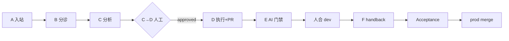

# 飞书 Inbound 全员参与指南

面向 ASP 全员：按你在流水线中的角色使用 **Cursor Skill** + **脚本**。  
环境引导（浅 clone / sparse checkout、不必 pull rootgrove）：[onboarding_inbound_skills.md](./onboarding_inbound_skills.md)

---

## 流水线与角色



| 段 | 谁参与 | Cursor Skill | 常用命令 |
|----|--------|--------------|----------|
| **B 分诊** | 总监机（默认 Marvin） | `feishu-inbound-triage` | `bash scripts/run_feishu_inbound_triage.sh` |
| **C 分析** | Issue assignee（各 surface lead） | `feishu-inbound-agent` | `python tools/feishu_inbound/issue_scanner.py --issue N --repo R` |
| **C→D 审方案** | Assignee / reviewer | `feishu-inbound-plan-approval` | `gh issue edit ... --add-label approved-to-execute` |
| **D 执行** | Assignee | `feishu-inbound-executor` | `python tools/feishu_inbound/issue_executor.py --issue N --repo R` |
| **E AI 门禁** | Assignee（与 D 不同 Agent 平台） | `feishu-inbound-gate-review` | `python tools/feishu_inbound/issue_pr_reviewer.py --issue N --repo R` |
| **合 dev** | Surface owner / lead | — | `gh pr merge`（人工） |
| **F handback** | 自动（lead tick） | — | `python tools/feishu_inbound/issue_dev_handback.py --scan-only` |
| **验收** | 提需人 / assignee | `feishu-inbound-acceptance` | `bash scripts/run_accept.sh pass --issue N --repo R` |
| **Legacy 人测** | 负责人（存量 issue） | `feishu-inbound-human-gate` | 见 [workflow_human_gate.md](../skills/workflow_human_gate.md) |
| **prod** | release owner（默认 @369795172） | — | merge promote PR |

ASP 默认分工见 `config/surfaces.yaml`（backend → 袁牧；app/admin → 胡剑飞）。

---

## 一次性环境（所有段共用）

```bash
git clone --depth 1 https://github.com/AI-MYG/asp.git ~/CursorWorks/asp-infra
cd ~/CursorWorks/asp-infra
bash scripts/bootstrap_inbound_cli.sh
gh auth login
```

**Lead 跑 C/D/E** 还需：

- `export GITHUB_ASSIGNEE=<你的 GitHub login>`
- Surface worktree（`ASP_WORKTREE_ROOT` 下 `projects/asp/backend` 等，见 `config/surfaces.yaml`）
- 可选：`bash launchd/install.sh`（总监机 / lead Mac 定时 lead tick）

**仅验收**（app/admin 提需人）：bootstrap + `run_accept.sh` 即可，见 [onboarding](./onboarding_inbound_skills.md)。

---

## Cursor 使用规则

1. **Open Folder → `asp` 仓库根**（不是 `asp-backend` 单独仓库）
2. 对 Agent 说清 **段 + issue 号 + repo**，例如：「Pipeline D，执行 asp-backend#148」
3. Agent 应 **在本机终端跑脚本**，不要只用 `gh issue comment` 代替引擎步骤（尤其 Acceptance、Executor）
4. Skill 索引：[skills/INDEX.md](../skills/INDEX.md)

---

## 按场景速查

### 我是 assignee，新 issue 分到我名下

1. C：`issue_scanner.py --issue N` 或等 lead tick
2. 审自己的 Analysis 或请 reviewer：`feishu-inbound-plan-approval`
3. D：`issue_executor.py --issue N`
4. E：`issue_pr_reviewer.py --issue N`
5. 合 dev PR → 等 F → 请提需人 `run_accept.sh pass`

### 我是提需人，只要验收 dev

`bash scripts/run_accept.sh pass --issue N --repo AI-MYG/asp-<surface>`

### 我是总监机，跑分诊

`bash scripts/run_feishu_inbound_triage.sh`（:10/:40 launchd）

### 分析要打回重跑

`gh issue edit N --repo R --add-label request-reanalysis`

---

## 文档地图

| 文档 | 内容 |
|------|------|
| [onboarding_inbound_skills.md](./onboarding_inbound_skills.md) | 最小 clone、sparse checkout、验收 |
| [skills/workflow_inbound_pipeline.md](../skills/workflow_inbound_pipeline.md) | ASP 版全流程 |
| [skills/workflow_inbound_pipeline_full.md](../skills/workflow_inbound_pipeline_full.md) | 完整 SSOT |
| [skills/INDEX.md](../skills/INDEX.md) | 全部 workflow + Cursor skill 表 |
| [cicd_pipeline.md](./cicd_pipeline.md) | CI/CD 与飞书通知节点 |

维护者从 rootgrove 同步 skill：`bash tools/feishu_inbound/sync_skills_to_asp_infra.sh`
