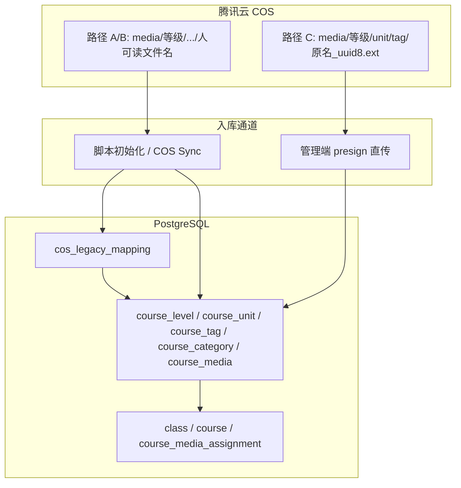
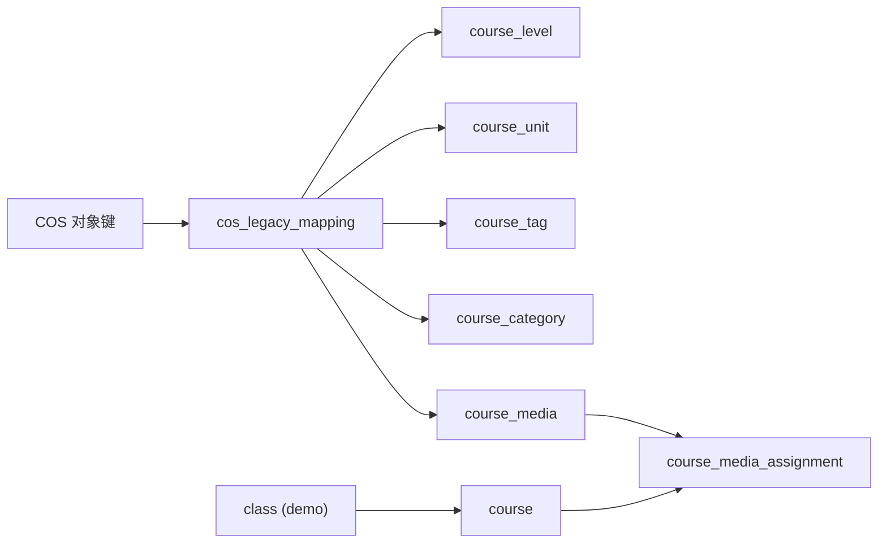
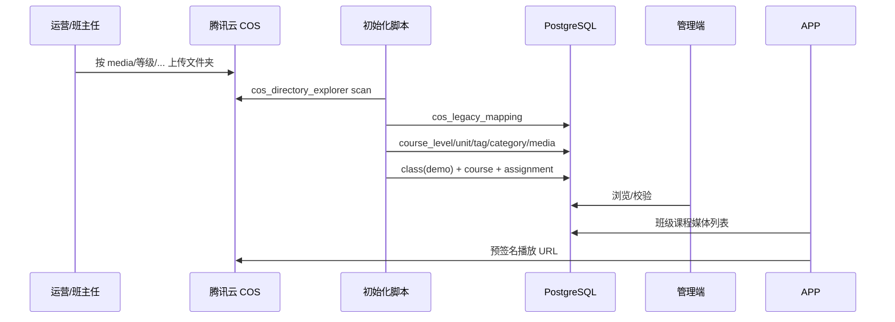

# 腾讯云 COS 课程媒体数据流

<!-- project: ASP -->
<!-- 维护: asp-infra 文档库 -->
<!-- 最后更新: 2026-06-16 -->

## 1. 文档目的

从**数据流视角**说明：当 ASP 新增一个「等级课程」时，媒体如何从腾讯云 COS 进入数据库，再经 API 被管理端与 APP 消费。

**读者**：后端、运维、课程运营（班主任）、Infra 维护者。

**相关 SSOT**：

- 领域模型：[domain_model.md](./domain_model.md) + [decisions/](./decisions/)
- 初始化 Workflow：`rules/skills/workflow_asp_course_initialization.md`（rootgrove monorepo）
- 端到端指南：`projects/asp/app/docs/tasks/current/complete_data_initialization_guide.md`

---

## 2. 业务背景：两套平行结构

| 侧 | 实体链 | 含义 |
|----|--------|------|
| **模板侧（与班级无关）** | `course_level` → `course_unit` → `course_media` | 「教什么」——等级、天/单元、媒体 |
| **班级交付侧** | `class` → `course` → `course_media_assignment` | 「何时给谁」——班级实例、按天课程、解锁排期 |

- **Demo 班级** = 某 `course_level` 的业务内容定义载体；班主任在 Demo 班更新内容，实质是更新 **unit 侧**的 `course_media`。
- `course` 是学员维度实体；除富文本等班级差异场景外，`unit_order` 通常即 `course_order`（现网部分等级存在漂移，读取顺序以 `unit_order` 为准，见 [domain_model.md §六](./domain_model.md)）。

---

## 3. COS 基础设施

| 配置项 | 来源 | 典型值 |
|--------|------|--------|
| Bucket | `config.tencent_cos_bucket_name` | `nativesense-1318847994`（默认） |
| Region | `config.tencent_cos_region` | `ap-guangzhou` |
| 课程媒体根前缀 | 约定 | `media/` |
| 转码输出 | `cos_client.build_cos_path` | `{原目录}/trans/{640\|720\|1280}_*.mp4` |
| 封面 | 同上 | `{原目录}/cov/{basename}.jpg` |

---

## 4. 三条入库路径总览



---

## 5. 路径 A：脚本/COS 文件夹初始化

### 5.1 适用场景

新增完整等级、大批量历史素材首次入库（班主任/运营先按目录规范上传到 COS，再由开发/脚本落库）。

### 5.2 COS 目录约定（人可读文件名）

**通用层级**（以四阶为例）：

```
media/四阶课程音视频/
└── Day17.B1 Play Police 场景引入/
    ├── 1.IP动画视频/
    │   └── L1-xxx动画视频.mp4          ← 文件名保留业务语义
    ├── 2.自如老师视频/
    └── 3.自如老师音频/
```

**中阶（含子等级）**：

```
media/中阶课程音视频/
└── 1.母语感中阶每日音视频合集-练气期/
    └── Day1-歌曲L1 Walking Walking&L2 This is the way/
        └── 2.自如老师视频/
            └── L1-Walking Walking自如老师视频.mp4
```

各等级 COS 前缀与脚本矩阵见 `workflow_asp_course_initialization.md`（如 `media/三阶课程音视频/`、`media/高阶课程音视频/` 等）。

### 5.3 具体执行步骤（以四阶 `run_sijie_initialization.sh` 为例）

| 步骤 | 动作 | 命令/脚本 |
|------|------|-----------|
| S0 | 环境预检、DB 连通 | `source venv/bin/activate` |
| S1 | 扫描 COS → JSON | `python scripts/cos_directory_explorer.py scan-to-json "media/四阶课程音视频/" --output data/cos_scan_四阶_result.json` |
| S2 | 路径解析写入映射表 | `python scripts/init_from_cos_pipeline.py --populate --target-level 四阶` |
| S3 | ER 表填充 | `python scripts/sijie/populate_sijie_course_data.py`（或 `populate_course_data_from_cos.py`） |
| S4 | 回填 duration/file_size | `python scripts/sijie/backfill_sijie_media_meta.py` |
| S5 | 创建 Demo 班 + 排期 | `python scripts/sijie/create_sijie_demo.py`（默认 `start_date` = 最近周一） |
| S6 | Assignment 完整性 Gate | `python scripts/repair_demo_missing_assignments.py --class-name "%四阶%demo%"`（dry-run 缺失数 = 0） |
| S7 | 验证 | `python scripts/sijie/verify_sijie_results.py` |

**统一管道兜底**：`scripts/init_from_cos_pipeline.py --run-all` / `--populate --target-level <等级>`

### 5.4 映射规则（COS → DB）

| COS 概念 | DB 字段 | 注意 |
|----------|---------|------|
| 顶层目录 | `course_level.name` | 勿与已有等级重名 |
| Day 目录 | `course_unit.name` / `unit_title` | 用 COS 原名，非「等级+DayN」 |
| 子文件夹 | `course_tag` | 如 `1.IP动画视频` → `IP动画` |
| Day 内主题 | `course_category` | 绘本名/主题，**不是**子文件夹 |
| 文件后缀 | `course_media.media_type` | `.mp4`→video, `.mp3`→audio 等 |
| 完整键 | `cos_legacy_mapping.cos_object_key` | UNIQUE |

解析实现：`scripts/init_from_cos_pipeline.py` 中 `parse_cos_path_unified()`。

### 5.5 数据库聚合（脚本路径）



`populate_course_data_from_cos.py` 从 `cos_legacy_mapping` 读取未映射媒体，插入 `course_media` 时：

- `tencent_file_id` = `cos_object_key`（完整 COS 键）
- `original_filename` = `basename(cos_object_key)`（人可读）
- 视频类 `cover_url` / `media_path` 指向 `cov/`、`trans/` 子路径模式

---

## 6. 路径 B：管理端 COS Sync（Workflow B）

将脚本能力产品化，班主任/运营在管理端扫描已有 COS 目录并确认入库。

### 6.1 API 流程

| 阶段 | 端点 | 说明 |
|------|------|------|
| 扫描 | `POST /api/v1/admin/cos-sync/scan` | body: `{ "cos_prefix": "media/四阶课程音视频/", "use_ai": false }` |
| 轮询批次 | `GET /api/v1/admin/cos-sync/{batch_id}` | 查看解析建议与变更类型 |
| 执行同步 | `POST /api/v1/admin/cos-sync/{batch_id}/execute` | 确认项写入 ER 表 |
| 回填元数据 | `POST /api/v1/admin/cos-sync/{batch_id}/backfill-meta` | duration 等 |
| 创建 Demo | `POST /api/v1/admin/cos-sync/{batch_id}/create-demo` | 班级 + assignment |

实现：`app/services/cos_sync_service.py`、`app/routers/admin_cos_sync.py`。

### 6.2 与脚本路径的关系

- COS 文件仍使用 **初始化目录结构**（人可读路径）
- `CosSyncService.create_or_update_media()` 以 `cos_object_key` 为幂等键写 `course_media`
- 同步成功时 `_upsert_cos_legacy_mapping()` 保持映射表与 ER 表一致

---

## 7. 路径 C：管理端单文件上传（音频/视频/图片）

### 7.1 前端流程

管理端（`VideoListView.vue` / `AudioListView.vue` / `ImageListView.vue`）：

1. `POST /api/v1/admin/upload/presign` — 校验元数据，创建 `course_media`（`upload_status=pending`）
2. 浏览器 `PUT` 到 `presigned_url`
3. `POST /api/v1/admin/upload/confirm` — 验证 COS 对象存在，状态 → `ready`

文档：`projects/asp/admin/docs/api/v1/admin/07_media_upload.md`

### 7.2 COS 路径生成（与管理端上传专用）

当同时提供 `course_level_id` + `course_unit_id` + `tag_id`：

```python
# upload.py presign
object_key = f"{info['base_dir']}/{stem}_{uuid.uuid4().hex[:8]}{ext}"
# base_dir = build_course_media_base_dir(level, unit, tag)
# 例: media/四阶课程音视频/Day1.B1 xxx/2.自如老师视频
```

`build_course_media_base_dir` 定义于 `app/utils/course_media_paths.py`：

```
media/{level_name}/{unit_dir}/{tag_dir}/
```

未提供完整三元组时，回退：

```
media/test/direct_upload/{YYYYMMDD_HHMMSS}_{uuid8}_{basename}.ext
```

### 7.3 路径校验

`app/utils/path_validator.py`：

- 新单元（尚无 ready 媒体）：允许上传，即使 `cos_legacy_mapping` 无记录
- 已初始化单元：放宽为单元下任意 tag 可上传
- 否则要求 `cos_legacy_mapping` 或 COS 目录已存在（`DIRECTORY_NOT_INITIALIZED`）

---

## 8. 核心对比：存储路径 vs 数据库一致性

| 维度 | 脚本/COS Sync 初始化 | 管理端 presign 上传 |
|------|----------------------|---------------------|
| COS 前缀 | `media/{等级COS目录名}/...` | 同上 `base_dir`（需 level/unit/tag） |
| 文件名 | 人可读，如 `L1-Walking Walking自如老师视频.mp4` | `{原名}_{8位hex}.ext` |
| 中间表 | 必经 `cos_legacy_mapping` | 通常跳过，直写 `course_media` |
| DB 统一键 | `course_level_id`, `course_unit_id`, `tag_id`, `category_id` | 相同 |
| COS 唯一标识 | `cos_object_key` / `tencent_file_id` | 相同 |

**结论**：COS 物理路径可以不同，但逻辑维度（等级 / 单元 / 标签 / 分类）在 DB 层统一；播放与变更检测依赖 `cos_object_key`。

> **关于「哈希文件名」**：管理端上传的文件名并非内容哈希，而是 `{原始文件名 stem}_{uuid4 前 8 位 hex}{扩展名}`，用于避免 COS 键冲突。

---

## 9. API 查询与播放

### 9.1 管理端

- 媒体 CRUD：课程/媒体管理 API（按 `course_level_id`、`course_unit_id` 筛选）
- COS Sync 批次：`/admin/cos-sync/*`

### 9.2 APP 端（学员）

| 场景 | 端点 | 查询内容 |
|------|------|----------|
| 班级某天媒体列表 | `GET /api/v1/class/{class_id}/courses/{course_id}/media` | join `course_media_assignment` → `course_media` |
| 媒体详情+播放 URL | `GET /api/v1/course/media/{media_id}`（app 路由） | `DBCourseMedia` + 预签名/转码 URL |
| COS 多清晰度 | `GET /api/v1/video/cos-play-url/{media_id}` | 扫描 `trans/` 下 640/720/1280 变体 |

播放逻辑（`app/routers/course.py` `_get_media_detail_app`）：

1. `normalize_course_media_paths_and_get_object_key()` 解析 COS 键
2. `build_cos_path()` 得 `base_path`、`filename_basename`
3. 视频：`get_transcoded_url_by_exact_basename()`；音频：`generate_public_url(object_key)`

### 9.3 班级排期

- `class.start_date` + `course_media_assignment.unlock_after_days` → `unlock_at`（节假日跳过见 `HolidayManager`）
- Demo 默认开课日：最近周一（`app/utils/demo_start_date.py`）

---

## 10. 端到端时序（新增等级 · 脚本路径）



---

## 11. 参考文件索引

| 类型 | 路径 |
|------|------|
| 初始化 Workflow | `rules/skills/workflow_asp_course_initialization.md` |
| Skill 入口 | `.cursor/skills/asp-course-initialization/SKILL.md` |
| 统一管道 | `projects/asp/backend/backend/scripts/init_from_cos_pipeline.py` |
| 四阶 shell | `projects/asp/backend/backend/scripts/sijie/run_sijie_initialization.sh` |
| ER 填充 | `projects/asp/backend/backend/scripts/populate_course_data_from_cos.py` |
| COS Sync 服务 | `projects/asp/backend/backend/app/services/cos_sync_service.py` |
| COS Sync API | `projects/asp/backend/backend/app/routers/admin_cos_sync.py` |
| 上传 presign/confirm | `projects/asp/backend/backend/app/routers/upload.py` |
| 路径构建 | `projects/asp/backend/backend/app/utils/course_media_paths.py` |
| 路径校验 | `projects/asp/backend/backend/app/utils/path_validator.py` |
| COS 客户端 | `projects/asp/backend/backend/app/utils/cos_client.py` |
| DB 模型 | `projects/asp/backend/backend/app/database_models.py` |
| 映射表文档 | `projects/asp/backend/docs/db/public.cos_legacy_mapping.md` |
| 完整初始化指南 | `projects/asp/app/docs/tasks/current/complete_data_initialization_guide.md` |
| COS 直传任务 | `projects/asp/admin/docs/tasks/current/20260302_cos_direct_upload.md` |
| Workflow B 需求 | `projects/asp/app/docs/tasks/current/20260205_batch_folder_upload_requirement.md` |

---

## 12. 已知陷阱

1. **tag 与 category 不可颠倒**（子文件夹 → tag；Day 主题 → category）
2. **「四阶」与「四阶原创」是不同 COS 前缀**
3. **Demo `--force-recreate` 可能丢失 assignment**（须 S6 repair gate）
4. **COS↔DB 漂移**需配合长效基建（issues #5/#7 类问题），单次补数据会再生
5. **gunicorn 勿 import scripts/** — 共享逻辑放 `app/utils/`
6. **转码子目录**：当前代码使用 `trans/`；部分旧文档仍写 `adpt/`，以 `cos_client.build_cos_path` 为准
